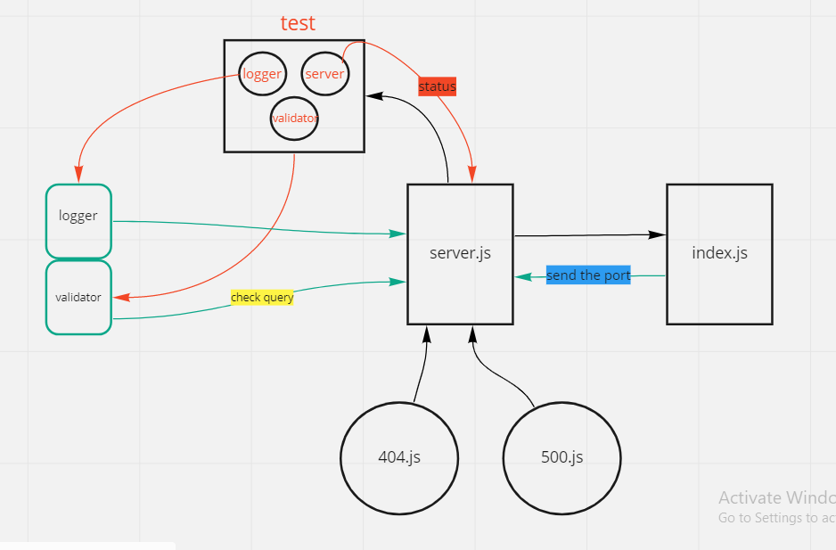

# basic-express-server

*Auther: Abeer Rafati*

**This app to explain how to creat a server and test it for deployment(Heroku)**   

[Produchion deployment](https://class2-server.herokuapp.com/)    
[Pull req](https://github.com/AbeerAl-Rafati/First_api_server/pull/1)   

*To use this app:*
- clone this repo  
- `cd First_api_server` 
- to download all dependencies used in this app, use in terminal 
> `npm i` 
- to run the server use in terminal  
> `nodemon` 
- to run test it use in termintl 
> `npm test`    
- to see the user page :
> add a query after the link `?name='anyname'` to show the result

